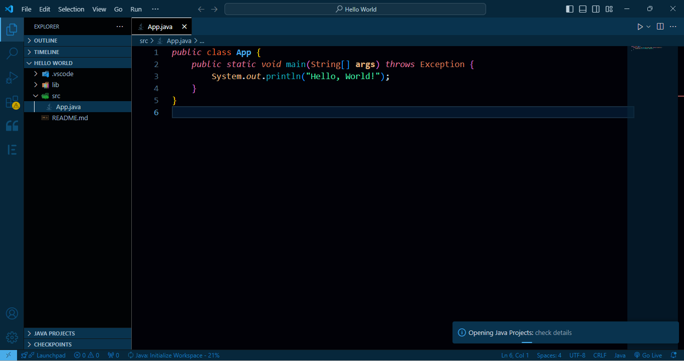
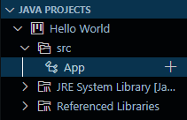
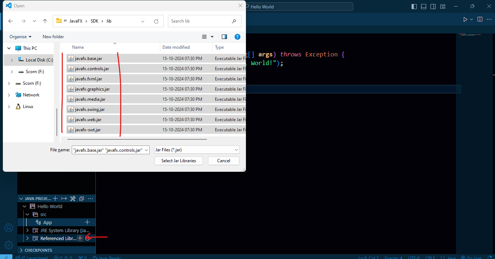
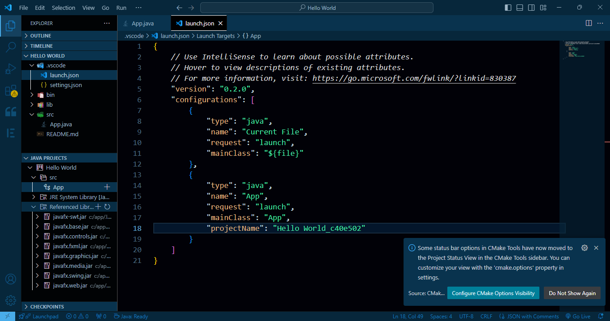
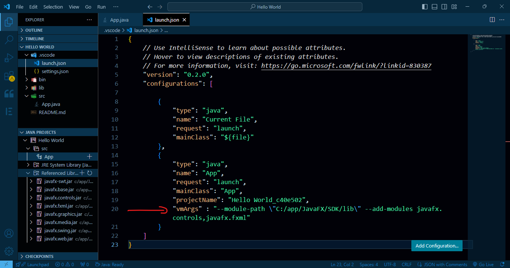
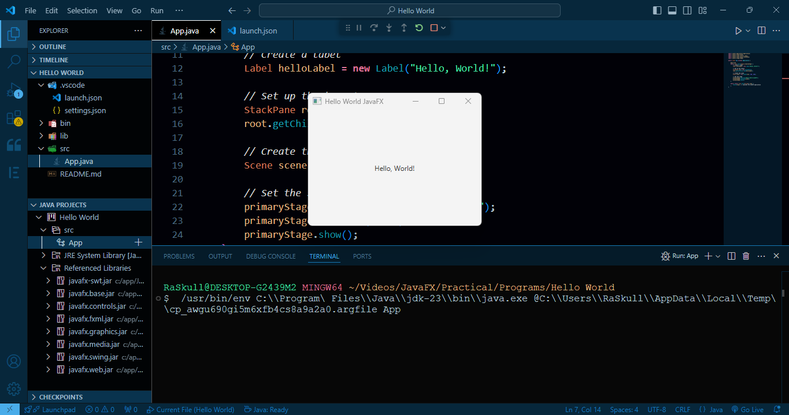

1. install `Extension Pack for java - by microsoft` from extension store.  
2. Open Designated Folder.  
3. create new java project with no build tool.  
4. Enter the desired names & hit enter.  
### Preview:  
  
5. at bottom of side bar `JAVA PROJECT` will appear, expand the project from there  
### Preview:  
  
6. click plus icon on `Referenced libraries`  
7. select the safe path of SDK folder & select the all the jar files & hit ok  
### Preview:  
  
8. & from Panel => `Run` => `Add configuration` this will open launch.json  
9. now open the official website documentation of JAVAFX, the same we downloaded both files.  
10. copy the command from there  
### Preview:  
  
```bash

```  
create your own statement out of this by pasting your javafx lib path here.  
 my path is `"C:\app\JavaFX\SDK\lib"` so will paste it that  
 but we need to do some alters in this string,  
 like replace all the bcakward slash with forward
 `"C:\app\JavaFX\SDK\lib"`  => `"C:/app/JavaFX/SDK/lib"` 
 & add backward slash at the first character & second last character of the string   
 `"C:/app/JavaFX/SDK/lib"` => `\"C:/app/JavaFX/SDK/lib\"`  
 paste it into statement above  
 `\"C:/app/JavaFX/SDK/lib\"`  => `--module-path \"C:/app/JavaFX/SDK/lib\" --add-modules javafx.controls,javafx.fxml`   
 & finally make it keyvalue pair with key `"vmArgs"` & value being this statement  
 `"vmArgs" : "--module-path \"C:/app/JavaFX/SDK/lib\" --add-modules javafx.controls,javafx.fxml"`  
11. now add this statment into `lauch.json` under project name property.  
### Preview:  
  
12. now replace the basic hello world programm of javaFX inside `App.java` & run it  
```java
import javafx.application.Application;
import javafx.scene.Scene;
import javafx.scene.control.Label;
import javafx.scene.layout.StackPane;
import javafx.stage.Stage;

public class App extends Application {

    @Override
    public void start(Stage primaryStage) {
        // Create a label
        Label helloLabel = new Label("Hello, World!");

        // Set up the layout
        StackPane root = new StackPane();
        root.getChildren().add(helloLabel);

        // Create the scene
        Scene scene = new Scene(root, 300, 200);

        // Set the stage
        primaryStage.setTitle("Hello World JavaFX");
        primaryStage.setScene(scene);
        primaryStage.show();
    }

    public static void main(String[] args) {
        launch(args); // Launches the JavaFX application
    }
}
```  
### Preview:  
  